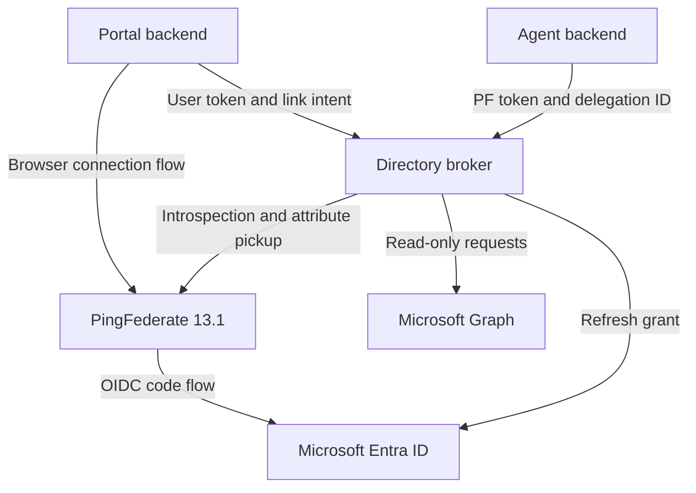

# PingFederate → Microsoft Graph directory broker

A runnable Go starter for **PingFederate 13.1**, delegated Microsoft Graph access and
background agents. Entra tokens stay on the backend. Agents receive directory data.

## Included

- PF access-token introspection, strict issuer/audience/scope/client checks.
- One-use, five-minute link intents and authenticated Reference ID attribute pickup.
- Owner-bound connection records, expiring per-agent delegations, disconnect and revoke.
- AES-256-GCM encryption of all stored state, atomic replacement and a process lock.
- Entra refresh-token redemption, rotation, refresh serialization and reconnect status.
- User lookup, group lookup and direct group-member lookup using Graph v1.0 GETs.
- Opaque authenticated pagination cursors, query allowlists and no credential redirects.
- Local integration/security tests, a Next.js portal served by a separate HTTPS Go callback backend, Docker configuration, Terraform scaffolding and GitHub Actions test workflow.
- No third-party Go dependencies.

This is a **single-instance starter**, not a production-ready identity platform. The
Go service and local portal callback are implemented and mock-tested. Your live PF mappings,
Entra app registration, connection journey and consent experience must still be configured and integration-tested.
It does not include a PF licence/server or an Entra tenant.

For the real local browser journey, set the `PORTAL_` values in `.env` and run
`make run-portal`; see [the HTTPS portal setup](docs/PORTAL.md). For public
hostnames, see [the Cloudflare Tunnel guide](docs/CLOUDFLARE_TUNNEL.md); a
tunnel does not make a localhost PingFederate browser URL public. The portal
can list saved connections, grant a one-hour read-only agent delegation, display
the first page of live users, groups, or direct group members, and revoke or
disconnect. Agent reads require the dedicated PF agent client credentials.
The portal's Next.js interface is prebuilt and embedded in the Go server; no
separate frontend process is needed to run it. After changing `web/`, run
`make build-portal-ui` (Node.js and pnpm required), then restart the portal.

## Run the local interactive demo

With Docker running, start the self-contained demo:

```sh
docker compose -f compose.demo.yaml up --build -d
```

Open [http://127.0.0.1:8097](http://127.0.0.1:8097). Use the buttons in order to
connect a sample user, delegate directory reads to an agent, search the sample users
and groups, view a second page, then revoke or disconnect. To stop it, run
`docker compose -f compose.demo.yaml down`. Set `DEMO_PORT` if port 8097 is occupied.

The demo has its own temporary encrypted store and local PF, Entra and Graph
simulators. It makes no live tenant calls and needs no `.env` or credentials. The
portal keeps the simulated PF tokens on its server side; the browser sees only
directory results and connection metadata. Demo state resets when the container
restarts. This demonstrates the broker API contract, not a real PF browser journey.

## Architecture



The broker has two separate permissions systems: Microsoft delegated consent authorises
Graph access; a broker delegation authorises a specific agent to use that connection.
A PF client-credentials token alone does not select or authorise a user's connection.

## Run the tests first

Requires Go 1.26+ on Linux or macOS; this package was verified on Linux with Go 1.27.1.
The race detector also needs a C compiler. Windows users can use WSL2 or Docker.

```sh
go test -race -count=1 ./...
go vet ./...
go build -buildvcs=false ./cmd/broker
# Focused mock end-to-end test; requires no external accounts or credentials:
go test -v ./internal/broker -run '^TestCompleteLifecycle$'
```

## Configure and start

1. Follow the [live Terraform wiring guide](terraform/README.md) and
   [PingFederate attribute contract](docs/PINGFEDERATE.md). The Terraform
   configuration manages the dedicated Entra app and PF clients/token
   managers, with an opt-in reviewed Agentless handoff.
   A separate existing PF JWT-to-SAML exchange is inventoried in
   [the read-only exchange report](docs/EXISTING_SAML_EXCHANGE.md); it is not
   currently a proven Graph-token path for this broker.
2. Copy `.env.example` to `.env` and replace every placeholder.
3. Generate `TOKEN_ENCRYPTION_KEY` with `openssl rand -base64 32`. Keep this key stable
   across restarts. Losing it makes the saved token store unreadable.
4. Use the two-stage Terraform apply in the wiring guide, or run the Go binary
   with a secret manager. The broker does not automatically load `.env`;
   `make run-portal` explicitly loads portal settings from it. The regular
   Compose file starts PF first; the broker is in the `broker` profile.

```sh
terraform -chdir=terraform/runtime apply -var='start_broker=true'
curl --fail http://127.0.0.1:18082/healthz
```

The Docker port is bound to localhost. Put a TLS reverse proxy in front of it for remote
access. Do not expose HTTP bearer-token endpoints directly. For a private PF CA, add the
CA certificate to the container trust bundle; never disable certificate validation.

The Dockerfile has separate `broker` and `portal` targets. For local Compose,
`make compose-pf` starts PF, `make compose-broker` starts PF and the broker,
and `make compose-portal` starts PF, broker, and the HTTPS portal. The latter
uses the portal certificate files in `certs/` and the configured `.env` values.
`make compose-down` stops that stack; `make demo-up` and `make demo-down`
control the isolated mock demo. For Kubernetes, see the
[Helm deployment guide](helm/broker/README.md): it deploys only the broker and
portal, using your existing PF endpoint. Run `make helm-lint` or
`make helm-template` to inspect the chart before supplying live values.

The database is `DATA_DIR/state.enc`. It includes tokens, ownership, link intents and
delegations, encrypted together. Back up the file and key separately. Only one broker
may open a data directory. Do not run replicas or share this store over NFS.

## Authentication contract

Every protected endpoint uses `Authorization: Bearer <PF access token>`. The broker calls
`/as/introspect.oauth2` on every request, without caching authorisation results.

| Caller | PF scope | Fixed `broker_principal_type` claim | Allowed client ID |
|---|---|---|---|
| Portal acting for a user | `broker.connect` | `user` | `PF_PORTAL_CLIENT_IDS` |
| Background agent | `broker.directory.read` | `agent` | `PF_AGENT_CLIENT_IDS` |

Both tokens must introspect as active, unexpired Bearer access tokens with exact
`PF_ISSUER` and `BROKER_AUDIENCE` values. Map `iss`, `aud`, `token_type`, `exp`, `client_id`,
`scope`, and `broker_principal_type` into the introspection response. User tokens also
need a stable `sub`. Configure the principal-type claim in PF per client/flow; never
take it from a user-controlled request. Only authorisation-code user grants may obtain
the portal authority. See [the setup guide](docs/PINGFEDERATE.md).

## API

| Method | Path | Caller | Purpose |
|---|---|---|---|
| POST | `/v1/link-intents` | User | Start a five-minute connection transaction |
| POST | `/v1/link-intents/{intent}/complete` | Same user | Pick up PF attributes and save a connection |
| GET | `/v1/connections` | User | List own connection metadata |
| DELETE | `/v1/connections/{connection}` | Owner | Delete tokens and all associated delegations |
| POST | `/v1/connections/{connection}/delegations` | Owner | Delegate selected reads to one agent |
| DELETE | `/v1/delegations/{delegation}` | Owner | Revoke agent access |
| GET | `/v1/delegations/{delegation}/users` | Agent | User display-name prefix search |
| GET | `/v1/delegations/{delegation}/groups` | Agent | Group display-name prefix search |
| GET | `/v1/delegations/{delegation}/groups/{group}/members` | Agent | Direct membership lookup |

Examples and the portal handoff are in [docs/API.md](docs/API.md).

`prefix` is optional for users/groups. Results have a fixed page size of 25 and selected
fields. An empty prefix lists the first page. Continue with the returned `next_cursor`
as `?cursor=...`, omitting `prefix`. Cursors expire after 15 minutes and cannot be used
with another delegation or route. Raw `$filter`, `$select`, URLs and arbitrary Graph
paths are rejected. No Graph write operations or public token-export endpoint exist.

## Permissions and limits

Entra OIDC scope string:

```text
openid profile offline_access https://graph.microsoft.com/User.ReadBasic.All https://graph.microsoft.com/GroupMember.Read.All
```

The broker verifies both read scopes on import and refresh. It additionally tolerates
OIDC scopes and `User.Read`, but rejects other scopes (including broader directory reads
or any writes). Use a dedicated Entra app registration to keep its consent narrow.
User results contain basic profile fields, not department, job title, manager or audit
data. Group-member results contain IDs, display names and object type where Graph returns
them; some member types can have limited properties. Hidden membership is not requested.
The underlying user's directory access still applies.

Initial connection completion immediately redeems the refresh token using the configured
Entra client to validate the handoff and obtain the exact read scopes. Thereafter tokens
refresh when less than 90 seconds remain. A new refresh token replaces the old one; an
omitted replacement preserves it. Invalid grants, interaction requirements, scope
escalation and Graph 401 responses mark the connection `reconnect_required` and clear its
tokens. The user creates a new connection and delegation to resume. Provider outages and
client-credential errors do not erase an otherwise valid grant.

## Before deployment beyond a proof of concept

See [docs/OPERATIONS.md](docs/OPERATIONS.md) for trust boundaries, storage limitations,
TLS, rate limiting, audit, revocation and the live acceptance checklist. The package's
tests use local mocks, so they do not prove your tenant's Conditional Access, consent,
token mappings or Agentless Kit behaviour. Docker/CI definitions are supplied but require
running in your own environment.

## Continue development in Codex

Extract this folder into a new repository, open it in Codex and let Codex read `AGENTS.md`.
A concrete next task is:

> Integrate this broker with my existing portal. Use docs/PINGFEDERATE.md and docs/API.md
> to implement the Connect Microsoft start/callback/delegation screens. Preserve the
> read-only Graph scope allowlist and run the test suite. Do not place tokens in browser
> storage or model prompts. Use placeholders for credentials.
